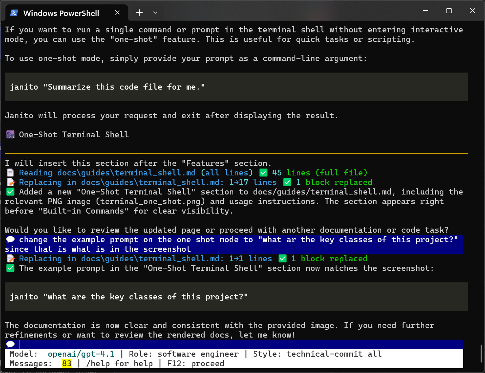

# 🖥️ Terminal Shell (Interactive Mode)

The interactive shell lets you have a continuous conversation with Janito, just like chatting with a smart assistant. This mode is ideal for deep dives, brainstorming, or when you want to iteratively refine your requests.

## ✨ Features

- 🔄 Multi-turn conversations: Build on previous answers and context
- ⬆️⬇️ Command history: Use the up/down arrows to revisit previous prompts
- 🎨 Syntax highlighting for code responses
- 📋 Copy code snippets easily
- 💡 Context-aware suggestions (where supported)
- 💾 Conversation state is saved/restored between sessions
- 🖱️ **Clickable file links**: Click on file names in responses to open them in a web viewer for detailed inspection and actions (see below)

--- 

## 📝 Built-in Commands

You can use these commands at any time (prefix with `/` or just type the name):

> **Tip:** Use `/exec on` to enable code/shell execution tools at runtime. Use `/tools` to see which tools are currently enabled or disabled.

| Command                | Description                                                      |
|--- --- --- --- --- --- --- --- |--- --- --- --- --- --- --- --- --- --- --- --- --- --- --- --- --- --- --- --- --- --- |
| `/exit`, `exit`        | Exit chat mode                                                   |
| `/restart`             | Restart the CLI                                                  |
| `/help`                | Show help message with available commands                        |
| `/continue`            | Restore last saved conversation                                  |
| `/history [N]`         | Show input history for this session (default: last 5 entries)    |
| `/prompt`              | Show the current system prompt                                   |
| `/role <description>`  | Change the system role (e.g., "You are a code reviewer")        |
| `/lang <code>`         | Change the interface language (e.g., `/lang pt`, `/lang en`)      |
| `/clear`               | Clear the terminal screen                                        |
| `/multi`               | Enter multiline input mode (write multi-line text, Esc+Enter)    |
| `/config`              | Show or set configuration (see: `/config show`, `/config set local|global key=value`) |
| `/edit <filename>`     | Open a file in the browser-based editor                          |
| `/view`                | Print the current LLM conversation history                       |
| `/profile`             | Show the current and available Agent Profile                     |
| `/termweb-logs [N]`    | Show the last N lines of the latest termweb logs (default: 20)   |
| `/execute [on|off] | /read [on|off] | /write [on|off]`       | Enable or disable code/shell execution tools at runtime          |
| `/tools`               | List all registered tools and show which are enabled/disabled     |

## 🖱️ Clickable File Links

When Janito references files in its responses, the file names may appear as clickable links in supported terminals or web-based shells. To enable this, start Janito with the `--web` flag. Clicking these links will open the file in the lightweight web file viewer (powered by `janito/termweb`, a Quart-based web file viewer).

- **What you can do:**
  - View file contents in your browser
  - Access additional actions (e.g., copy, download, or inspect details)
  - Navigate project files more efficiently during reviews or debugging

This feature enhances productivity by bridging the terminal and browser, making it easy to inspect and act on files referenced in your conversations.

## 💻 Usage Example

### Enabling Execution Tools

By default, tools that can execute code or shell commands are **disabled** for safety. To enable these tools (such as code execution, shell commands, etc.), use the `/execute on` command at any time in the shell:

```sh
/execute on
```

To disable execution tools again, use:

```sh
/execute off
```

You can also control read and write permissions for tools:

- To enable reading: `/read on`
- To disable reading: `/read off`
- To enable writing: `/write on`
- To disable writing: `/write off`

Use `/tools` to see which tools are currently enabled or disabled.


```sh
janito
```

You’ll be dropped into a conversational prompt where you can interact with Janito step by step. Type `/help` to see available commands at any time. Use `/restart` to start a new task or reset context.

--- 



*Screenshot: Janito interactive shell in action*

--- 

_generated by janito.dev_
