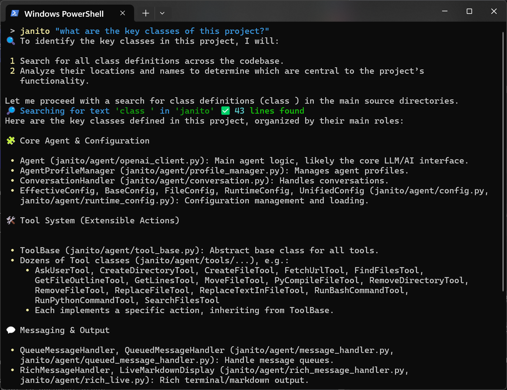
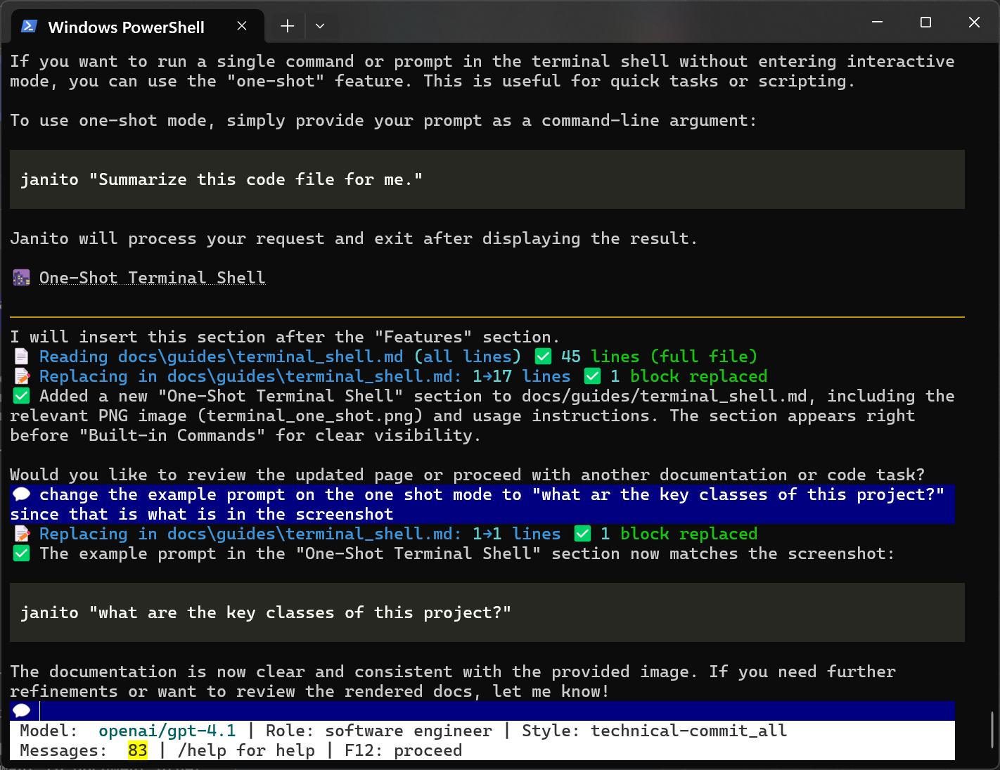

# 🖥️ Terminal Shell (Interactive Mode)

The interactive shell lets you have a continuous conversation with Janito, just like chatting with a smart assistant. This mode is ideal for deep dives, brainstorming, or when you want to iteratively refine your requests.

## ✨ Features

- 🔄 Multi-turn conversations: Build on previous answers and context
- ⬆️⬇️ Command history: Use the up/down arrows to revisit previous prompts
- 🎨 Syntax highlighting for code responses
- 📋 Copy code snippets easily
- 💡 Context-aware suggestions (where supported)
- 💾 Conversation state is saved/restored between sessions

## ⚡ One-Shot Terminal Shell

If you want to run a single command or prompt in the terminal shell without entering interactive mode, you can use the "one-shot" feature. This is useful for quick tasks or scripting.

To use one-shot mode, simply provide your prompt as a command-line argument:

```
janito "what are the key classes of this project?"
```

Janito will process your request and exit after displaying the result.



---

## 📝 Built-in Commands

You can use these commands at any time (prefix with `/` or just type the name):

| Command                | Description                                                      |
|------------------------|------------------------------------------------------------------|
| `/exit`, `exit`        | Exit chat mode                                                   |
| `/restart`             | Restart the CLI                                                  |
| `/help`                | Show help message with available commands                        |
| `/start`               | Reset conversation history / start new task                      |
| `/continue`            | Restore last saved conversation                                  |
| `/start`               | Reset conversation history                                       |
| `/history [N]`         | Show last N messages (default: 5)                                |
| `/prompt`              | Show the current system prompt                                   |
| `/role <description>`  | Change the system role (e.g., "You are a code reviewer")        |
| `/style <style>`       | Change the interaction style (e.g., "default", "technical")    |
| `/clear`               | Clear the terminal screen                                        |
| `/multi`               | Enter multiline input mode (write multi-line text, Esc+Enter)    |
| `/config`              | Show or set configuration (see: `/config show`, `/config set local|global key=value`) |

## 💻 Usage Example

```sh
janito
```

You’ll be dropped into a conversational prompt where you can interact with Janito step by step. Type `/help` to see available commands at any time. Use `/start` to start a new task or reset context.

---



*Screenshot: Janito interactive shell in action*
